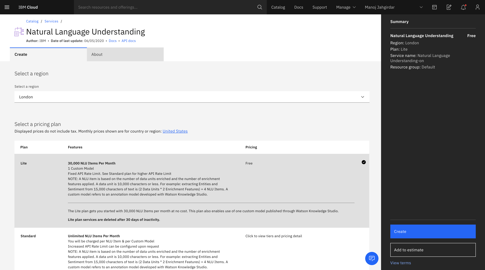
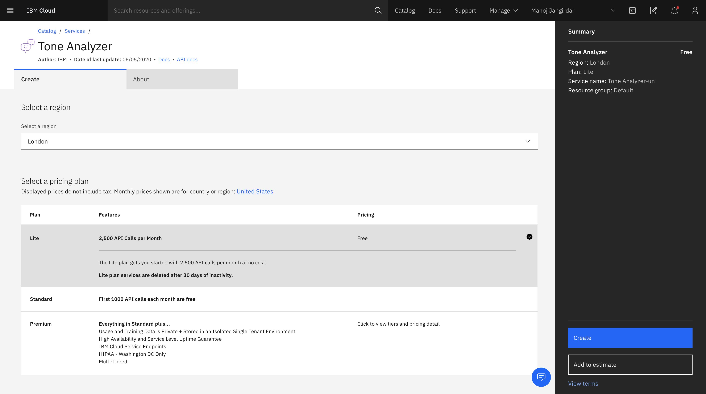
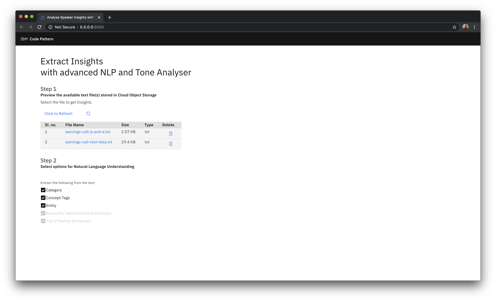

**Work in progress**

# Use Advanced NLP and Tone Analyser to extract insights

This Code Pattern is part of the series [Extracting Textual Insights from Videos with IBM Watson]()


In this code pattern, given a text file, we learn how to extract keywords, emotions, sentiments, positive sentences, and much more using Watson Natural Language Understanding and Tone Analyzer.

When you have completed this code pattern, you will understand how to:

* Use advanced NLP to analyze text and extract meta-data from content such as concepts, entities, keywords, categories, sentiment and emotion.
* Leverage Tone Analyzer's cognitive linguistic analysis to identify a variety of tones at both the sentence and document level.
* Connect applications directly to Cloud Object Storage.


<!--add an image in this path-->


<!--Optionally, add flow steps based on the architecture diagram-->
## Flow

1. The transcribed text from the [previous code pattern of the series](https://github.com/IBM/build-custom-stt-model-with-diarization) is retrived from Cloud Object Storage

2. Watson Natural Language Understanding and Watson Tone Analyzer is used to extract insights from the text.

3. The response from Natural Language Understanding and Watson Tone Analyzer is analyzed by the application and a Report is generated.

4. User can download the Report which consists of the textual insights.

<!--Optionally, update this section when the video is created-->
# Watch the Video

Coming Soon
<!-- [](https://www.youtube.com/watch?v=xgkYRJdBQ8E) -->

# Pre-requisites

1. [IBM Cloud](https://cloud.ibm.com) Account

2. [Docker](https://www.docker.com/products/docker-desktop)

3. [Python](https://www.python.org/downloads/release/python-365/)


# Steps

1. [Clone the repo](#1-clone-the-repo)

2. [Create Watson Services](#2-create-watson-services)

3. [Add the Credentials to the Application](#3-add-the-credentials-to-the-application)

4. [Deploy the Application](#4-deploy-the-application)

5. [Run the Application](#5-run-the-application)


### 1. Clone the repo

Clone the [`use-advanced-nlp-and-tone-analyser-to-analyse-speaker-insights`](https://github.com/IBM/use-advanced-nlp-and-tone-analyser-to-analyse-speaker-insights) repo locally. In a terminal, run:

```bash
$ git clone https://github.com/IBM/use-advanced-nlp-and-tone-analyser-to-analyse-speaker-insights
```

We will be using the following datasets from the Cloud Object Storage:

1. `earnings-call-test-data.txt` - To extract Keywords, sentiments, emotions, positive sentences, and more.

3. `earnings-call-Q-and-A.txt` - To extract Keywords, sentiments, emotions, positive sentences, and more.

### About the dataset

For the code pattern demonstration, we have considered `IBM Earnings Call Q1 2019` Webex recording. The data has 40min of IBM Revenue discussion, and 20+ min of Q & A at the end of the recording. We have split the data into 3 parts:

* `earnings-call-train-data.mp4` - (Duration - 24:40)
This is the initial part of the discussion from the recording which we will be using to train the custom Watson Speech To Text model in the second code pattern from the series.

* `earnings-call-test-data.mp4` - (Duration - 36:08)
This is the full discussion from the recording which will be used to test the custom Speech To Text model and also to get transcript for further analysis in the third code patten from the series.

* `earnings-call-Q-and-A.mp4` - (Duration - 2:40)
This is a part of Q & A's asked at the end of the meeting. The purpose of this data is to demonstrate how Watson Speech To Text can detect different speakers from an audio which will be demonstrated in the second code pattern from the series.

### 2. Create Watson Service

#### 2.1 Create Natural Language Understanding Service

- On IBM Cloud, create a [Natural Language Understanding](https://cloud.ibm.com/catalog/services/natural-language-understanding) service.



- In Natural Language Understanding Dashboard, Click on **Services Credentials**

- Click on **New credential** and add a service credential as shown. Once the credential is created, copy and save the credentials in a text file for using it in later steps in this code pattern.


#### 2.2 Create Tone Analyzer Service

- On IBM Cloud, create a [Tone Analyzer](https://cloud.ibm.com/catalog/services/tone-analyzer) service.



- In Tone Analyzer Dashboard, Click on **Services Credentials**

- Click on **New credential** and add a service credential as shown. Once the credential is created, copy and save the credentials in a text file for using it in later steps in this code pattern.


### 3. Add the Credentials to the Application

- In the [first code pattern](https://github.com/IBM/convert-video-to-audio) cloned repo, you will have updated **credentials.json** file with cloud object storage credentials. Copy that file and paste it in parent folder of the repo that you cloned in [step 1](#1-clone-the-repo).

- In the repo parent folder, open the **naturallanguageunderstanding.json** file and paste the credentials copied in [step 2.1](#2.1-create-natural-language-understanding-service) and save the file.

- Similarly, in the repo parent folder, open the **toneanalyzer.json** file and paste the credentials copied in [step 2.2](#2.2-create-tone-analyzer-service) and save the file.


### 4. Deploy the Application

<details><summary><b>With Docker Installed</b></summary>

- Build the **Dockerfile** as follows :

```bash
$ docker image build -t use-advanced-nlp-to-extract-insights .
```

- once the dockerfile is built run the dockerfile as follows :

```bash
$ docker run -p 8080:8080 use-advanced-nlp-to-extract-insights
```

- The Application will be available on <http://localhost:8080>

</details>

<details><summary><b>Without Docker </b></summary>

- Install the python libraries as follows:

    - change directory to repo parent folder
    
    ```bash
    $ cd use-advanced-nlp-and-tone-analyser-to-analyse-speaker-insights/
    ```

    - use `python pip` to install the libraries

    ```bash
    $ pip install -r requirements.txt
    ```

- Finally run the application as follows:

```bash
$ python app.py
```

- The Application will be available on <http://localhost:8080>

</details>

### 5. Run the Application

- Visit  <http://localhost:8080> on your browser to run the application.



#### We Extract _Category_, _Concept Tags_, _Entity_, _Keywords_, _Sentiments_, _Emotions_, _Top 5 Positive Sentences_ and _Word Cloud_ from the text in just 2 steps:

1. Click on `earnings-call-test-data.txt` as the text file to extract insights.

2. Select the entities that you want to extract from the text and click on **Analyze** as shown.


>- More about the entities:
>    - `Category` - Categorize your content using a five-level classification hierarchy. View the complete list of categories [here](https://cloud.ibm.com/docs/natural-language-understanding?topic=natural-language-understanding-categories-hierarchy).
>    - `Concept Tags`: Identify high-level concepts that aren't necessarily directly referenced in the text.
>    - `Entity`: Find people, places, events, and other types of entities mentioned in your content. View the complete list of entity types and subtypes [here](https://cloud.ibm.com/docs/natural-language-understanding?topic=natural-language-understanding-entity-type-systems).
>    - `Keywords`: Search your content for relevant keywords.
>    - `Sentiments`: Analyze the sentiment toward specific target phrases and the sentiment of the document as a whole.
>    - `Emotions`: Analyze emotion conveyed by specific target phrases or by the document as a whole.
>    - `Positive sentences`: The Watson Tone Analyzer service uses linguistic analysis to detect emotional and language tones in written text

>- Learn more features of:
>   - Watson Natural Language Understanding service. [Learn more](https://cloud.ibm.com/docs/natural-language-understanding?topic=natural-language-understanding-about).
>   - Watson Tone Analyzer service. [Learn more](https://cloud.ibm.com/docs/tone-analyzer?topic=tone-analyzer-gettingStarted).

- Once the NLU Analysis Report is generated you can review it and print it by clicking on the print button as shown.


### Summary

We have seen how to extract meaningful insights from the transcribed text files. In the [next code pattern of the series](https://github.com/IBM/use-advanced-nlp-and-tone-analyser-to-analyse-speaker-insights) we will learn how these three code patterns from the series can be plugged together so that uploading any video will extract audio, transcribe the audio and extract meaningfull insights all in one application.

<!-- keep this -->
## License

This code pattern is licensed under the Apache License, Version 2. Separate third-party code objects invoked within this code pattern are licensed by their respective providers pursuant to their own separate licenses. Contributions are subject to the [Developer Certificate of Origin, Version 1.1](https://developercertificate.org/) and the [Apache License, Version 2](https://www.apache.org/licenses/LICENSE-2.0.txt).

[Apache License FAQ](https://www.apache.org/foundation/license-faq.html#WhatDoesItMEAN)
