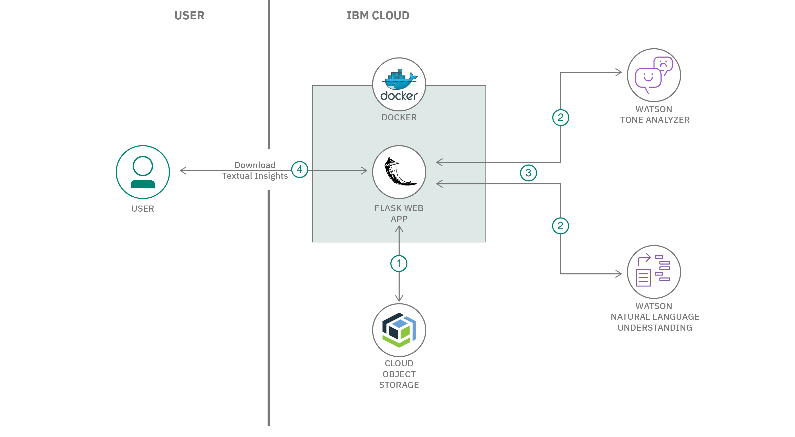

# Short Title

Use advanced NLP and Tone Analysis to extract meaningful insights.

# Long Title

Extract meaningful insights such as Categories, Concepts, Emotions, Entities, Keywords, Sentiments, Top 5 Positive Sentences and Word Clouds from a given text file, using advanced NLP and Tone Analysis.

# Author
* [Manoj Jahgirdar](https://www.linkedin.com/in/manoj-jahgirdar-6b5b33142/)
* [Manjula Hosurmath](https://www.linkedin.com/in/manjula-g-hosurmath-0b47031)

# URLs

### Github repo

* https://github.com/IBM/use-advanced-nlp-and-tone-analyser-to-analyse-speaker-insights

### Video Link
* https://www.youtube.com/watch?v=lkfxvoD_J0c

# Summary

In this code pattern, given a text file, we learn how to extract meaningful insights such as Category, Concepts, Emotion, Entities, Keywords, Sentiment, Top Positive Sentences and Word Clouds using Watson Natural Language Understanding and Watson Tone Analyzer.

# Technologies

* [Python](https://developer.ibm.com/technologies/python): An open-source interpreted high-level programming language for general-purpose programming.

* [Object Storage](https://developer.ibm.com/technologies/object-storage): Store large amounts of data in a highly scalable manner.

# Description

Natural Language Understanding includes a set of text analytics features that can be used to extract meanings from unstructured data such as a text file. Tone Analyzer on the other hand can understand emotions and communication style in a text. We combine the capabilities of both the services to extract meaningful insights from a given text file and generate a report that consists of Category, Concepts, Emotion, Entities, Keywords, Sentiment, Top Positive Sentences and Word Clouds using Python Flask runtime.

Refer this link for complete details of the series: https://developer.ibm.com/articles/text-mining-and-analysis-from-webex-recordings

# Flow

<!--add an image in this path-->

1. The transcribed text from the [previous code pattern of the series](https://github.com/IBM/build-custom-stt-model-with-diarization) is retrived from Cloud Object Storage.

2. Watson Natural Language Understanding and Watson Tone Analyzer is used to extract insights from the text.

3. The response from Natural Language Understanding and Watson Tone Analyzer is analyzed by the application and a Report is generated.

4. User can download the Report which consists of the textual insights.

# Instructions

> Find the detailed steps in the [README](https://github.com/IBM/use-advanced-nlp-and-tone-analyser-to-analyse-speaker-insights/blob/master/README.md) file.

1. Clone the repo

2. Create Watson Services

3. Add the Credentials to the Application

4. Deploy the Application

5. Run the Application

# Components and services

* [Natural Language Understanding](https://cloud.ibm.com/catalog/services/natural-language-understanding): Use advanced NLP to analyze text and extract meta-data from content such as concepts, entities, keywords, categories, sentiment, emotion, relations, and semantic roles. Apply custom annotation models developed using Watson Knowledge Studio to identify industry/domain specific entities and relations in unstructured text with Watson NLU.

* [Tone Analyzer](https://cloud.ibm.com/catalog/services/tone-analyzer): People show various tones, such as joy, sadness, anger, and agreeableness, in daily communications. Such tones can impact the effectiveness of communication in different contexts. Tone Analyzer leverages cognitive linguistic analysis to identify a variety of tones at both the sentence and document level. This insight can then used to refine and improve communications. It detects three types of tones, including emotion (anger, disgust, fear, joy and sadness), social propensities (openness, conscientiousness, extroversion, agreeableness, and emotional range), and language styles (analytical, confident and tentative) from text.

* [Object Storage](https://cloud.ibm.com/catalog/services/cloud-object-storage): IBM Cloud Object Storage is a highly scalable cloud storage service, designed for high durability, resiliency and security. Store, manage and access your data via our self-service portal and RESTful APIs. Connect applications directly to Cloud Object Storage use other IBM Cloud Services with your data.
